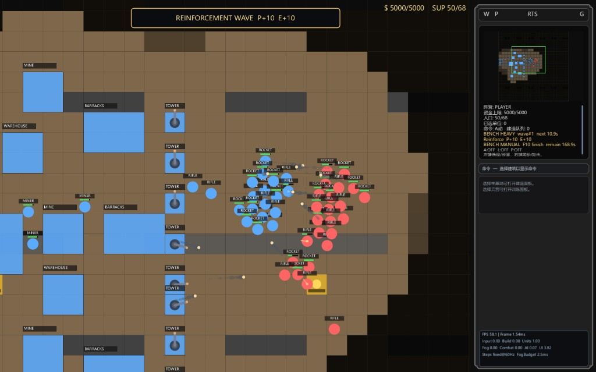

# RTS_p5

A Processing-based RTS prototype inspired by classic games (StarCraft / Red Alert), with a refactored `GameEngine` architecture, configurable benchmark tooling, and scriptable performance workflows.

**Current release:** [v0.2.9](https://github.com/ShenyfZero9211/RTS_p5/releases/tag/v0.2.9)



## Highlights

- Fullscreen RTS prototype built with Processing 4 CLI.
- `GameEngine` wrapper over `GameState` with fixed-step simulation.
- Data-driven runtime and gameplay knobs via JSON files in `RTS_p5/data`.
- Localization support (`zh/en/auto`) with persisted user settings.
- Configurable benchmark system:
  - single-run benchmark (`benchmark.ps1`)
  - matrix benchmark (`benchmark-matrix.ps1`)
  - grouped compare report (`benchmark-compare.ps1`)
  - markdown/HTML visualization (`benchmark-viz.ps1`, `tools/benchmark_dashboard.py`)
- Manual controllable benchmark mode:
  - `-ManualControl`
  - `-ManualEndKey`
  - `-ManualAutoFrontline`
- **RTS Map Editor** (separate Processing sketch under `map_editor/`): edit terrain, spawns, mines, initial buildings/units; validation; `Ctrl+R` writes to `RTS_p5/data/map_test.json` for a quick in-game check.

## Repository Layout

- `RTS_p5/` - main Processing sketch folder
  - `RTS_p5.pde` - thin app entrypoint
  - `GameEngine.pde` - top-level app/game orchestrator
  - `GameState.pde` - gameplay state and subsystem coordination
  - subsystem files (`EnemyAiController.pde`, `CombatSystem.pde`, `ProductionSystem.pde`, `FogSystem.pde`, `UISystem.pde`, etc.)
  - `data/` - game configs, map files, runtime settings
- `benchmarks/` - **local only** (listed in `.gitignore`): runtime CSV, benchmark logs, matrix/compare/visual reports, HTML dashboards, `runs/` sheets. Written by `BenchmarkRuntime` (path `../benchmarks/...` from the sketch) and root `benchmark*.ps1` scripts.
- `map_editor/` - map editor sketch (`map_editor.pde` + editor modules)
- root scripts
  - `build.ps1` - build sketch through Processing CLI
  - `map-editor.ps1` - run the map editor (`cli --run`)
  - `smoke.ps1` - lightweight build smoke check
  - `benchmark.ps1` - single benchmark run
  - `benchmark-matrix.ps1` - profile x intensity batch benchmark
  - `benchmark-compare.ps1` - latest-vs-previous grouped comparison
  - `benchmark-viz.ps1` - markdown visual report generation
- `tools/benchmark_dashboard.py` - interactive HTML dashboard generator
- `docs/benchmark_workflow.md` - benchmark usage guide
- `docs/processing_ai_handoff.md` - this repo: scripts, sketches, AI handoff
- `docs/processing_project_playbook.md` - general Processing + `.ps1` + `.md` playbook

## Requirements

- Windows + PowerShell
- Processing 4 (default path used by scripts):
  - `D:\Program Files\Processing\Processing.exe`
- Python 3 (for HTML dashboard script)

## Build

```powershell
powershell -ExecutionPolicy Bypass -File .\build.ps1
```

Default output:

- `_cli_build_out`

## Map editor

```powershell
powershell -ExecutionPolicy Bypass -File .\map-editor.ps1
```

Uses the same default Processing path as `build.ps1`; override with `-ProcessingExe` and `-SketchDir` if needed. **Pan:** middle mouse or **Space + left drag**. **Zoom:** mouse wheel (same convention as in-game camera). See `docs/processing_ai_handoff.md` for details.

## Run Benchmarks

### 1) Single benchmark run

```powershell
powershell -ExecutionPolicy Bypass -File .\benchmark.ps1 -DurationSec 120 -WarmupSec 10 -BattleIntensity heavy -TroopProfile balanced
```

### 2) Manual controllable benchmark session

```powershell
powershell -ExecutionPolicy Bypass -File .\benchmark.ps1 -RunTag manual-session -ManualControl -ManualEndKey F10 -ManualAutoFrontline -DurationSec 180 -WarmupSec 10 -BattleIntensity heavy -TroopProfile balanced
```

Notes:

- `-ManualControl`: user controls gameplay.
- `-ManualEndKey F10`: press F10 to finish and write metrics.
- `-ManualAutoFrontline`: keep AI mutual frontline push in manual mode.

### 3) Matrix benchmark (batch)

```powershell
powershell -ExecutionPolicy Bypass -File .\benchmark-matrix.ps1 -Profiles balanced,rush -Intensities medium,heavy -TroopProfile swarm
```

This runs combinations and (by default) auto-generates:

- matrix markdown summary
- visual markdown report
- HTML dashboard

### 4) Compare and visualize

```powershell
powershell -ExecutionPolicy Bypass -File .\benchmark-compare.ps1
powershell -ExecutionPolicy Bypass -File .\benchmark-viz.ps1
python .\tools\benchmark_dashboard.py
```

## Benchmark Data Notes

- Runtime CSV path: `benchmarks/runtime_metrics.csv` (repository root; not committed)
- Grouped comparison key:
  - `enemy_ai_profile | battle_intensity | reinforce_interval_sec | reinforce_count_per_faction | troop_profile`
- Legacy/mixed CSV compatibility is handled in compare script with fallbacks (`unknown/default`).

## Architecture Summary

- `RTS_p5.pde` delegates all app callbacks to `GameEngine`.
- `GameEngine` manages:
  - mode switching (`MENU` / `PLAYING`)
  - time stepping (`TimeSystem`)
  - benchmark runtime hook (`BenchmarkRuntime`)
  - localization/font bootstrap
- `GameState` owns world/session data and delegates domains to subsystem classes.

## Development Tips

- The whole `benchmarks/` directory is **gitignored**; benchmark outputs stay on your machine only.
- For benchmark workflow details, read:
  - `docs/benchmark_workflow.md`
- For AI-assisted Processing workflow (scripts, handoff, verification), read:
  - `docs/processing_ai_handoff.md`
- For per-script and tool reference (with diagrams), read:
  - `docs/scripts_and_tools_reference.md`
  - `docs/processing_project_playbook.md` (generic template)

## Changelog (recent)

### v0.2.9

- Map editor sketch (`map_editor/`) with terrain brush, spawns, mines, buildings/units, validation, and save/load against `RTS_p5/data` JSON maps.
- `map-editor.ps1` launcher; editor viewport uses top-left camera convention and zoom range aligned with `Camera.pde` (wheel zoom toward cursor).
- Docs: `docs/processing_ai_handoff.md`, `docs/processing_project_playbook.md`.

