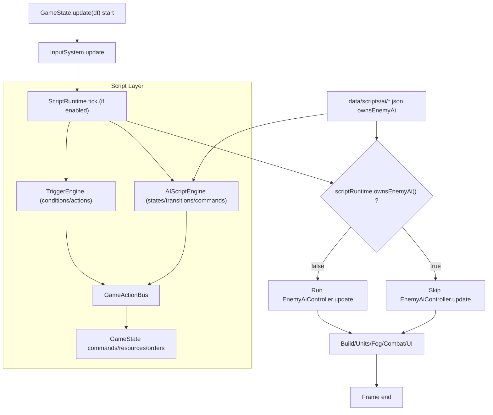

# RTS_p5 AI 控制权流转图

本文记录 `ownsEnemyAi` 在当前脚本系统中的生效位置，以及旧 AI 与脚本 AI 的控制权流转。

## 结论

- `ownsEnemyAi: true`：脚本 AI 接管敌方 AI，旧 `EnemyAiController.update(...)` 跳过。
- `ownsEnemyAi: false`：旧 AI 继续执行，脚本层不独占控制权。

## 控制权流转

## 代码锚点

- 主循环与分支判断：`RTS_p5/GameState.pde`
- 脚本运行时与 `ownsEnemyAi()`：`RTS_p5/ScriptRuntime.pde`
- AI DSL 样例：`RTS_p5/data/scripts/ai/default_battle.json`

