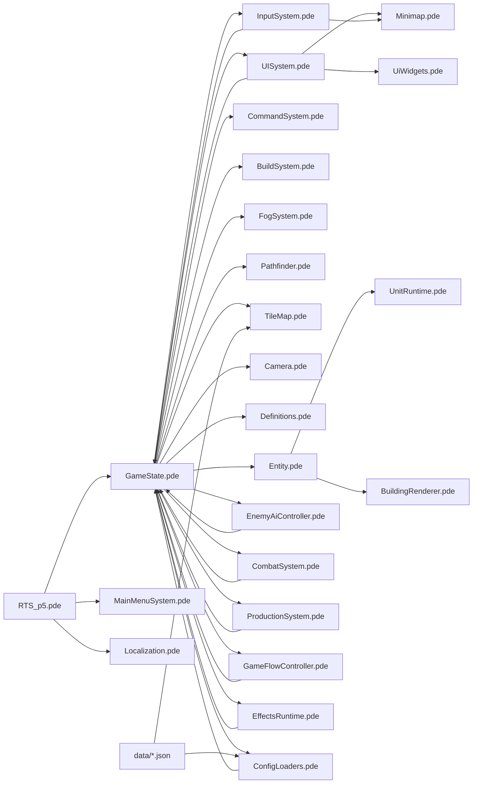

## 重构前后职责清单（1页版）

### 改造目标
- 把 `GameState` 从“全能类”收敛为“调度与状态中心”
- 业务按子系统拆文件，降低变更扩散
- 输入/UI/AI 尽量通过命令入口，减少直接改字段

---

### 重构前（主要痛点）
- `GameState.pde` 同时负责：
  - 生命周期、配置加载、AI、训练、战斗、投射物、特效、胜负结算、UI覆盖层
- `Entity.pde` 同时负责：
  - 单位行为更新 + AI + 渲染（耦合较高）
- 问题表现：
  - 一处功能修改常跨 `GameState` / `InputSystem` / `UISystem` / `Entity`
  - 回归风险高，定位耗时

---

### 重构后（文件职责）

- `RTS_p5/GameState.pde`
  - **调度器**：update/render 主流程、世界状态容器、系统装配
  - **命令边界**：`issueMoveCommand` / `issueAttackMoveCommand` / `setSelectedBuildingRally` 等
  - 尽量不再承载具体子系统实现细节

- `RTS_p5/EnemyAiController.pde`
  - 敌方宏观 AI（ECO/TECH/MUSTER/ATTACK）
  - 侦查记忆、进攻波次、探索逻辑

- `RTS_p5/CombatSystem.pde`
  - 塔防目标选择、开火逻辑
  - 导弹生成/更新/渲染（含 `RocketProjectile` / `RocketSmoke`）

- `RTS_p5/ProductionSystem.pde`
  - 训练队列生命周期
  - 出生点计算/回退策略
  - 训练取消与返还（含 `TrainJob`）

- `RTS_p5/GameFlowController.pde`
  - 胜负判定
  - 结算弹层渲染与点击动作

- `RTS_p5/ConfigLoaders.pde`
  - `UiSettingsLoader`：`ui.json` 参数加载与约束
  - `DefinitionsLoader`：`units.json` / `buildings.json` 定义加载

- `RTS_p5/EffectsRuntime.pde`
  - 非投射物特效与命令标记：
  - `MuzzleFx` / `DeliveryFx` / `OrderMarker` 的 update/render

- `RTS_p5/UnitRuntime.pde`
  - `UnitCombatLogic`：单位战斗AI与玩家防御AI逻辑委托
  - `UnitRenderer`：单位渲染委托

- `RTS_p5/BuildingRenderer.pde`
  - 建筑渲染委托（含塔体/炮管可视化）

- `RTS_p5/Entity.pde`
  - 保留核心数据结构与行为入口
  - Unit/Building 的复杂渲染与部分AI已下沉到 runtime/renderer

---

### 当前协作约定（建议团队统一）
- **新增玩法优先加到子系统文件**，避免回填 `GameState`
- `InputSystem` 触发动作优先走 `GameState` 命令入口
- 渲染改动优先在 `UnitRenderer` / `BuildingRenderer` / `EffectsRuntime`
- 规则/经济/训练改动优先在 `ProductionSystem` / `CombatSystem` / `EnemyAiController`

---

### 典型改动落点速查
- “改敌军进攻策略” → `EnemyAiController.pde`
- “改塔/导弹打击效果” → `CombatSystem.pde`
- “改训练队列与出生点” → `ProductionSystem.pde`
- “改胜负判定或结算弹层” → `GameFlowController.pde`
- “改单位表现或血条标签” → `UnitRuntime.pde`
- “改建筑外观/炮塔朝向显示” → `BuildingRenderer.pde`
- “改配置读取规则” → `ConfigLoaders.pde`

---

### 收益（交接视角）
- `GameState` 体积和职责显著下降，阅读入口更清晰
- 改动范围更可预测，减少“牵一发动全身”
- 新成员可按“功能域”而非“巨型文件”上手

如果你要，我可以再给一版“新人上手 30 分钟路线图”（按阅读顺序 + 关键断点）。

# GameState Refactor Handoff (1-page)

## Goal
- Reduce `GameState` from a god-class to an orchestrator/state hub.
- Split gameplay domains into subsystem files.
- Route input/UI/AI actions through stable command APIs where possible.

## Before Refactor (Pain Points)
- `GameState.pde` handled too many concerns:
  - lifecycle, config loading, AI, production, combat, projectiles, effects, win flow, overlay UI.
- `Entity.pde` mixed:
  - unit behavior updates + AI + rendering.
- Result:
  - feature changes spread across `GameState` / `InputSystem` / `UISystem` / `Entity`.
  - high regression risk and expensive debugging.

## After Refactor (Responsibility Map)

- `RTS_p5/GameState.pde`
  - Orchestrator: update/render flow, world state container, subsystem wiring.
  - Command boundary methods: `issueMoveCommand`, `issueAttackMoveCommand`, `setSelectedBuildingRally`, etc.
  - Keeps compatibility wrappers; delegates concrete domain logic out.

- `RTS_p5/EnemyAiController.pde`
  - Enemy macro AI phases (ECO/TECH/MUSTER/ATTACK).
  - Recon memory, explore logic, attack wave decisions.

- `RTS_p5/CombatSystem.pde`
  - Tower target selection and firing behavior.
  - Rocket lifecycle: spawn/update/render (`RocketProjectile`, `RocketSmoke`).

- `RTS_p5/ProductionSystem.pde`
  - Training queue lifecycle.
  - Spawn-point resolution and fallback.
  - Training cancellation/refund (`TrainJob` included).

- `RTS_p5/GameFlowController.pde`
  - Win/lose condition checks.
  - End overlay rendering and click actions.

- `RTS_p5/ConfigLoaders.pde`
  - `UiSettingsLoader`: loads and clamps `ui.json`.
  - `DefinitionsLoader`: loads `units.json` and `buildings.json`.

- `RTS_p5/EffectsRuntime.pde`
  - Non-projectile runtime effects:
  - `MuzzleFx`, `DeliveryFx`, `OrderMarker` update/render.

- `RTS_p5/UnitRuntime.pde`
  - `UnitCombatLogic`: delegated unit combat AI logic.
  - `UnitRenderer`: delegated unit rendering.

- `RTS_p5/BuildingRenderer.pde`
  - Delegated building rendering (including tower visuals).

- `RTS_p5/Entity.pde`
  - Keeps core data structures and behavior entry points.
  - Complex rendering/combat-AI parts moved to runtime/renderer helpers.

## Team Conventions (Recommended)
- Add new features to subsystem files first, avoid re-growing `GameState`.
- Prefer `GameState` command APIs from `InputSystem`/UI paths.
- Rendering changes go to `UnitRenderer` / `BuildingRenderer` / `EffectsRuntime`.
- Rules/economy/production/combat changes go to:
  - `ProductionSystem`, `CombatSystem`, `EnemyAiController`.

## Quick Change Routing
- Enemy strategy tuning -> `EnemyAiController.pde`
- Tower/rocket behavior or visuals -> `CombatSystem.pde`
- Training queue/spawn/cancel -> `ProductionSystem.pde`
- Win/defeat and settlement overlay -> `GameFlowController.pde`
- Unit visuals/labels/hp bar -> `UnitRuntime.pde`
- Building visuals/turret look -> `BuildingRenderer.pde`
- Config loading rules -> `ConfigLoaders.pde`

## Handoff Value
- Smaller and clearer ownership boundaries.
- More predictable change impact.
- Faster onboarding by feature domain instead of one giant file.

## GameState Runtime Flow Diagram

```mermaid
flowchart TD
  drawLoop[RTS_p5 draw loop] --> appModeCheck{appMode}
  appModeCheck -->|PLAYING| sessionReady{game.sessionReady}
  sessionReady -->|yes| gsUpdate[GameState.update dt]
  sessionReady -->|yes| gsRender[GameState.render]
  sessionReady -->|no| emptyFrame[background only]

  gsUpdate --> inputUpdate[InputSystem.update]
  gsUpdate --> buildUpdate[BuildSystem.update]
  gsUpdate --> markerUpdate[EffectsRuntime.updateOrderMarkers]
  gsUpdate --> unitTick[Unit.update for each unit]
  gsUpdate --> unitCollision[resolveUnitAgainstSolids and separation]
  gsUpdate --> deadCleanup[remove dead units and buildings]
  gsUpdate --> fogUpdate[FogSystem.update]
  gsUpdate --> combatTick[CombatSystem.updateRockets and updateTowerDefense]
  gsUpdate --> fxTick[EffectsRuntime.updateMuzzleFx and updateDeliveryFx]
  gsUpdate --> prodTick[ProductionSystem.updateTrainQueue]
  gsUpdate --> aiTick[EnemyAiController.update]
  gsUpdate --> capsRefresh[refreshFactionCaps]
  gsUpdate --> winCheck[GameFlowController.checkWinCondition]

  gsRender --> mapRender[TileMap.render]
  gsRender --> mineRender[renderGoldMines]
  gsRender --> buildingRender[Building.render -> BuildingRenderer]
  gsRender --> rallyRender[renderRallyPoints]
  gsRender --> unitRender[Unit.render -> UnitRenderer]
  gsRender --> rocketRender[CombatSystem.renderRockets]
  gsRender --> fxRender[EffectsRuntime.renderMuzzleFx and renderDeliveryFx]
  gsRender --> fogOverlay[FogSystem.renderOverlay]
  gsRender --> hudRender[renderWorldHudResources and debug]
  gsRender --> previewRender[BuildSystem.renderPreview and selection box]
  gsRender --> orderMarkerRender[EffectsRuntime.renderOrderMarkers]
  gsRender --> uiRender[UISystem.render]
  gsRender --> endOverlay{gameEnded}
  endOverlay -->|yes| settlementRender[GameFlowController.renderGameEndOverlay]

  inputEvents[mouse and key events] --> inputRoute[RTS_p5 event routing]
  inputRoute --> gameInput[GameState.onMouse and onKey]
  gameInput --> inputSystem[InputSystem handlers]
  inputSystem --> commandAPI[GameState command API]
  commandAPI --> moveCmd[issueMoveCommand]
  commandAPI --> attackMoveCmd[issueAttackMoveCommand]
  commandAPI --> attackCmd[issueAttackUnit and Building]
  commandAPI --> rallyCmd[setSelectedBuildingRally]
  commandAPI --> cancelCmd[cancelBuildPlacement]
```

## File Dependency Diagram

