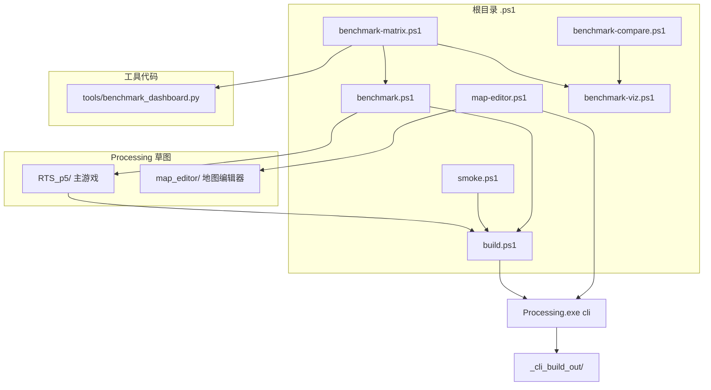
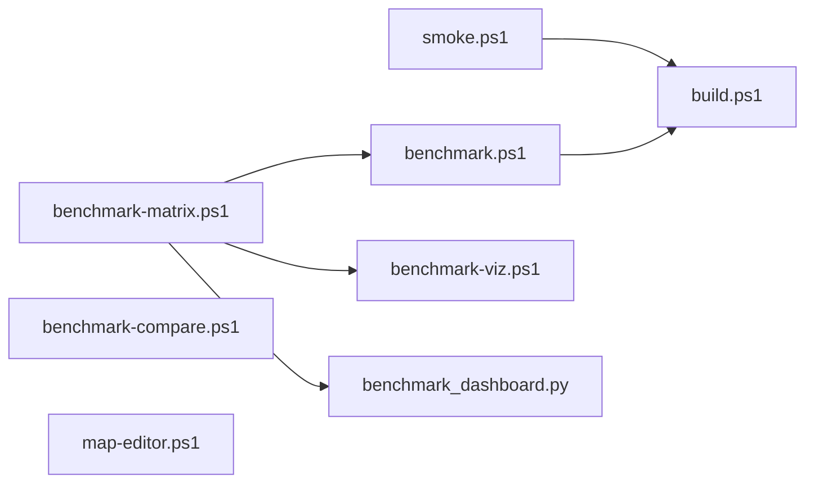
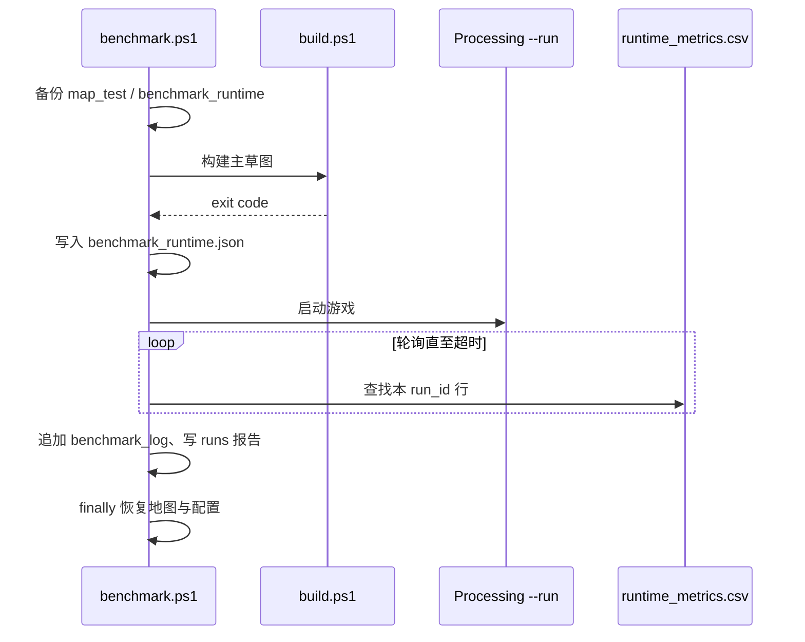
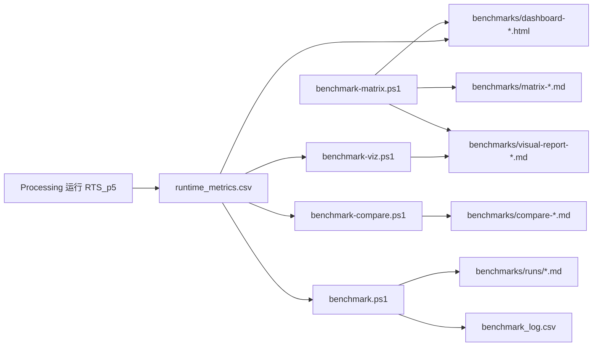

# 根目录脚本与工具代码说明（RTS_p5）

本文逐项说明仓库根目录 **PowerShell 脚本**、**Python 工具** 与 **Processing 草图** 的职责，并用图表串起调用关系。默认环境为 **Windows + Processing 4 CLI**；可执行文件路径可用各脚本的 `-ProcessingExe` 等参数覆盖。

相关文档：

- `README.md`：快速命令与仓库总览  
- `docs/processing_ai_handoff.md`：AI 协作与验收习惯  
- `docs/benchmark_workflow.md`：benchmark 流程细节  
- `docs/processing_project_playbook.md`：通用 Processing 工程手记  

---

## 1. 总览：草图与脚本在仓库中的位置

---

## 2. 脚本依赖关系（谁调用谁）

说明：

- **只有** `build.ps1`、`map-editor.ps1`、`benchmark-compare.ps1` 不依赖其它本仓库 `.ps1`（compare 只读 CSV）。  
- **`smoke.ps1`**、**`benchmark.ps1`** 依赖 **`build.ps1`**。  
- **`benchmark-matrix.ps1`** 循环调用 **`benchmark.ps1`**，可选再跑 **`benchmark-viz.ps1`** 与 **`tools/benchmark_dashboard.py`**。  

---

## 3. 逐项说明

### 3.1 `build.ps1`

| 项目 | 说明 |
|------|------|
| **用途** | 用 Processing 4 CLI 对 **主游戏草图** `RTS_p5/` 执行 **`--build`**，导出到输出目录。 |
| **默认草图** | `RTS_p5`（与文件夹名一致） |
| **默认输出** | `_cli_build_out/`（与 `.gitignore` 一致，构建产物不入库） |
| **关键参数** | `-ProcessingExe`、`-SketchDir`、`-OutputDir` |
| **典型场景** | 本地导出、CI/冒烟前的编译、benchmark 运行前的刷新构建 |

---

### 3.2 `smoke.ps1`

| 项目 | 说明 |
|------|------|
| **用途** | **轻量冒烟**：调用 `build.ps1` 后，检查 `_cli_build_out` 是否存在、非空，且其中是否有 **`.jar` / `.exe`** 或名称形如 **`RTS_p5*`** 的候选产物。 |
| **不做什么** | 不 `--run` 游戏；不跑地图编辑器；不测 benchmark。 |
| **关键参数** | `-ProjectRoot`、`-ProcessingExe`（传给 `build.ps1`） |
| **典型场景** | 改完主草图后「至少能编出来」的快速门禁 |

---

### 3.3 `map-editor.ps1`

| 项目 | 说明 |
|------|------|
| **用途** | 对 **`map_editor/`** 草图执行 Processing CLI **`--run`**，启动 **RTS Map Editor** 窗口。 |
| **关键参数** | `-ProcessingExe`、`-SketchDir`（默认指向 `map_editor`） |
| **典型场景** | 编辑地图 JSON、与主游戏 `data/` 地图管线配合调试 |

---

### 3.4 `benchmark.ps1`

| 项目 | 说明 |
|------|------|
| **用途** | **单次**运行时性能采集：备份当前测试用地图与运行时配置，将指定地图模板拷到 `map_test.json`，写入 `benchmark_runtime.json` 启用自动对局/时长等，然后 **build + `cli --run`**；轮询 `benchmarks/runtime_metrics.csv` 是否出现本次 `run_id`；最后追加 `benchmarks/benchmark_log.csv` 一行、生成 `benchmarks/runs/<runId>.md`，并在 `finally` 中 **恢复地图与配置**（或关闭 benchmark 配置）。 |
| **关键参数** | `-MapFile`、`-DurationSec`、`-WarmupSec`、`-BattleIntensity`、`-TroopProfile`、`-ManualControl` 等（详见 `README.md`） |
| **典型场景** | 单次压力图跑分、可选手动操控的 benchmark 会话 |

单次 benchmark 在逻辑上的阶段：

---

### 3.5 `benchmark-matrix.ps1`

| 项目 | 说明 |
|------|------|
| **用途** | **批量矩阵**：在 `enemyAiProfile`（如 balanced/rush/…）与 **战斗强度**（medium/heavy/extreme）的笛卡尔积上，多次调用 **`benchmark.ps1`**。运行前备份 **`RTS_p5/data/ui.json`**，循环中改写 `enemyAiProfile` 再跑 benchmark，`finally` 中恢复 UI。 |
| **默认后续** | 生成 `benchmarks/matrix-<时间戳>.md`；若未 `-SkipVisualize`，再调用 **`benchmark-viz.ps1`** 与 **`python tools/benchmark_dashboard.py`** 生成可视化 Markdown 与 HTML 看板。 |
| **关键参数** | `-Profiles`、`-Intensities`、`-TroopProfile`、`-SkipVisualize`、`-DurationSec` 等 |

---

### 3.6 `benchmark-compare.ps1`

| 项目 | 说明 |
|------|------|
| **用途** | 读取 **运行时 CSV**（默认 `benchmarks/runtime_metrics.csv`）或旧版 **`benchmarks/benchmark_log.csv`**（`-LegacyBuildLog`），按 **分组键**（AI 档案、强度、增援参数、兵种档案等）解析，输出 **对比分析 Markdown**（默认带时间戳写入 `benchmarks/compare-*.md`）。 |
| **特点** | 含对 **列数不齐 / 历史表头** 的兼容解析（尾部字段补全逻辑）。 |
| **不调用** | 不启动 Processing；不调用 `build.ps1`。 |

---

### 3.7 `benchmark-viz.ps1`

| 项目 | 说明 |
|------|------|
| **用途** | 从 **`benchmarks/runtime_metrics.csv`** 按行解析关键指标，按 `group_key` 聚合，生成 **Markdown 可视化报告**：各组最新快照、**回归告警**（最新 vs 前一次：FPS 下降或 p99 帧时上升超阈值）、profile × intensity 表格等。 |
| **关键参数** | `-CsvPath`、`-OutputPath`、`-TroopProfile`（过滤兵种档案） |
| **典型场景** | 单次或矩阵跑完后的可读摘要；与 `benchmark_dashboard.py` 互补（静态 MD vs 交互 HTML） |

---

## 4. Python：`tools/benchmark_dashboard.py`

| 项目 | 说明 |
|------|------|
| **用途** | 读取与 viz 同源的 **runtime CSV**，生成交互式 **HTML 仪表盘**（过滤、图表），便于在浏览器中探索多次 run。 |
| **调用方式** | `python .\tools\benchmark_dashboard.py`（参数见脚本内 `argparse`，矩阵脚本会传 `--project-root`、`--csv-path`、`--output-path`） |
| **依赖** | Python 3（见 `README.md`） |

---

## 5. 主游戏草图代码（RTS_p5）在脚本语境下的角色（简表）

脚本不逐个解释每个 `.pde`，下表仅说明 **与脚本直接相关的入口与数据**：

| 路径 / 文件 | 与脚本的关系 |
|-------------|----------------|
| `RTS_p5/RTS_p5.pde` | 主入口；`build.ps1` / `benchmark.ps1 --run` 的目标草图根 |
| `RTS_p5/data/map_test.json` | `benchmark.ps1` 在跑分时临时替换为模板地图，结束后从备份恢复 |
| `RTS_p5/data/benchmark_runtime.json` | benchmark 开关、时长、`run_id`、`outputCsv`（默认 `../benchmarks/runtime_metrics.csv`，相对草图目录即仓库根下 `benchmarks/`）等；跑分前后备份/恢复 |
| `RTS_p5/data/ui.json` | `benchmark-matrix.ps1` 临时改写 `enemyAiProfile` 后恢复 |
| `benchmarks/runtime_metrics.csv`（仓库根；`.gitignore`） | 游戏运行时追加的性能指标；`benchmark.ps1` 轮询、`benchmark-viz` / `compare` / dashboard 消费 |

更完整的架构分工见 `docs/gamestate_refactor_handoff.md`。

---

## 6. 地图编辑器草图（map_editor）

| 项目 | 说明 |
|------|------|
| **用途** | 独立 Processing 草图，用于编辑与主工程配合的地图等资源（见 `map_editor/map_editor.pde` 与各 `Editor*.pde`）。 |
| **启动** | `map-editor.ps1`（`cli --run`），不经过 `build.ps1`。 |
| **界面** | 顶栏菜单、左工具栏（含笔刷示意）、中地图+右上小地图、右侧列表与校验；悬停高亮；小地图点击跳转相机。 |

---

## 7. 快速命令索引

| 目标 | 命令（在仓库根目录） |
|------|----------------------|
| 仅编译主游戏 | `powershell -ExecutionPolicy Bypass -File .\build.ps1` |
| 编译 + 产物检查 | `powershell -ExecutionPolicy Bypass -File .\smoke.ps1` |
| 打开地图编辑器 | `powershell -ExecutionPolicy Bypass -File .\map-editor.ps1` |
| 单次 benchmark | 见 `README.md` 中 `benchmark.ps1` 示例 |
| 矩阵 + 可视化 | 见 `README.md` 中 `benchmark-matrix.ps1` 示例 |
| 对比报告 | `powershell -ExecutionPolicy Bypass -File .\benchmark-compare.ps1` |
| Markdown 可视化 | `powershell -ExecutionPolicy Bypass -File .\benchmark-viz.ps1` |
| HTML 看板 | `python .\tools\benchmark_dashboard.py`（参数按 README 或 `--help`） |

---

## 8. 数据流简图（benchmark 相关产出）

说明：`benchmark_log.csv` 与 `runtime_metrics.csv` 职责不同：前者偏 **构建与 UI 设置等元数据行** 与人工填报占位；后者为 **运行时自动采样的帧时间等指标**（viz/compare/dashboard 主要围绕 runtime CSV）。
